## RESULTS

* BB84 QKD Runtime
* BB84 QKD Runtime Scaling
* BB84 QKD Throughput Performance
* BB84 QKD CPU Performance
* BB84 QKD RAM Performance
* BB84 QKD Layer 2 Depth
* BB84 QKD Layer 2 Fidelity
* BB84 QKD Layer 2 Noise
* BB84 QKD Layer 2 CV
* BB84 QKD QBER vs Eavesdrop
* BB84 QKD Sifted Key
* BB84 QKD Secure Key Rate
* BB84 QKD Security Heatmap

---

### BB84 QKD Runtime
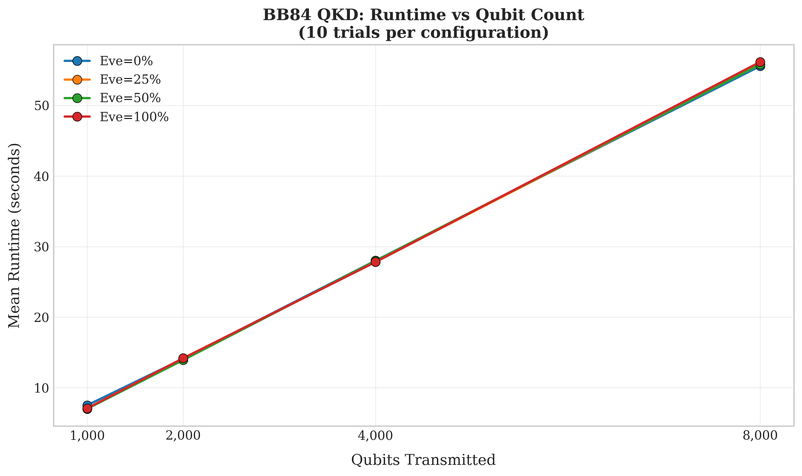

### BB84 QKD Runtime Performance
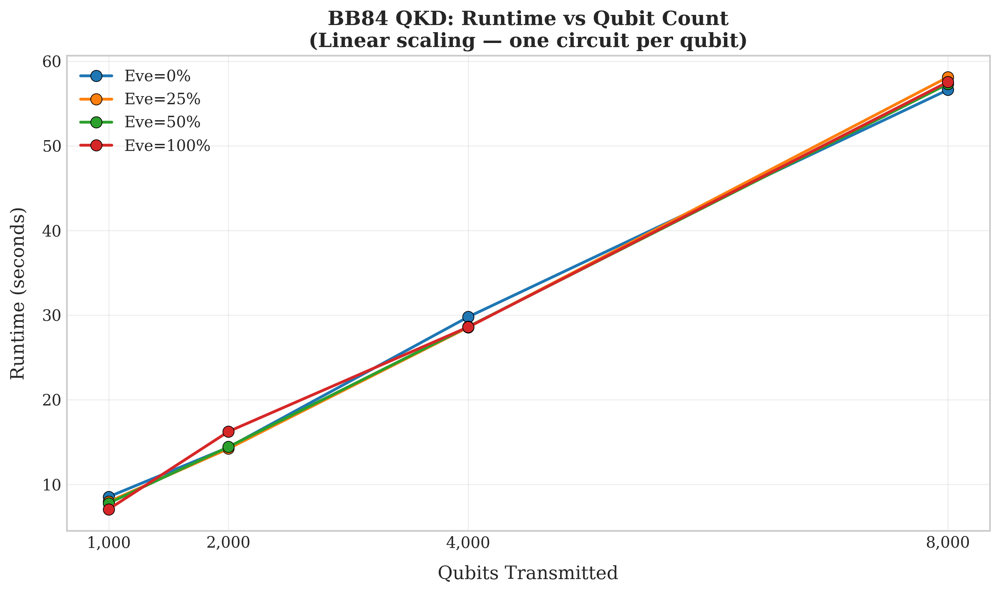

### BB84 QKD Throughput Performance
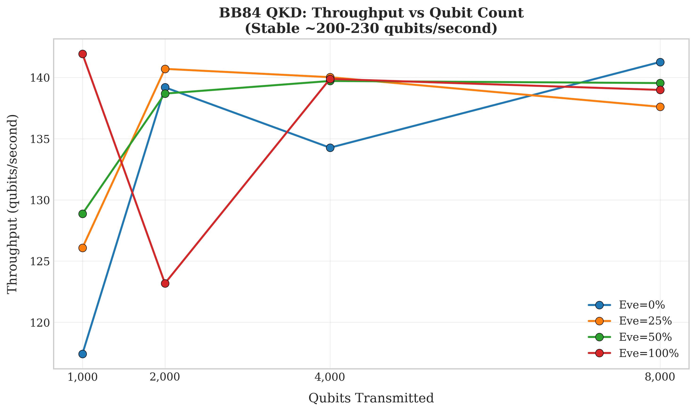

### BB84 QKD CPU Performance
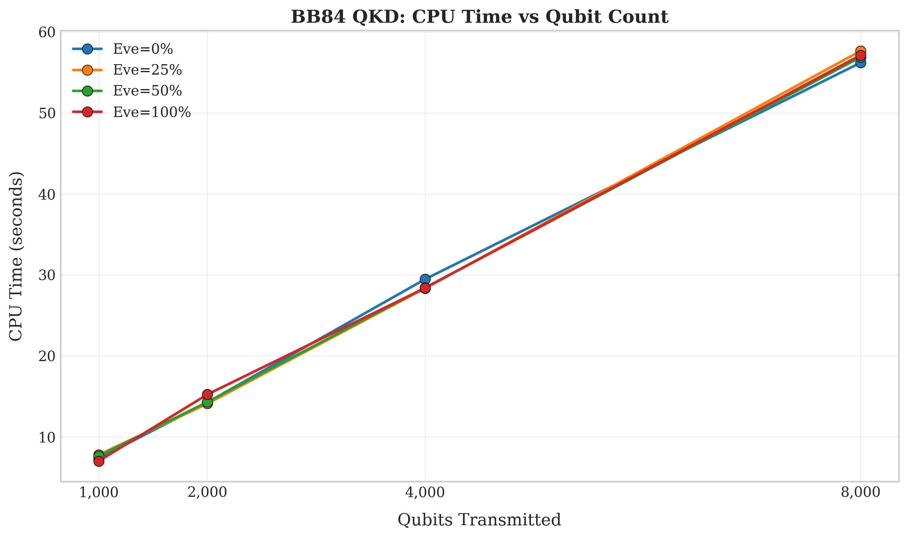

### BB84 QKD RAM Performance
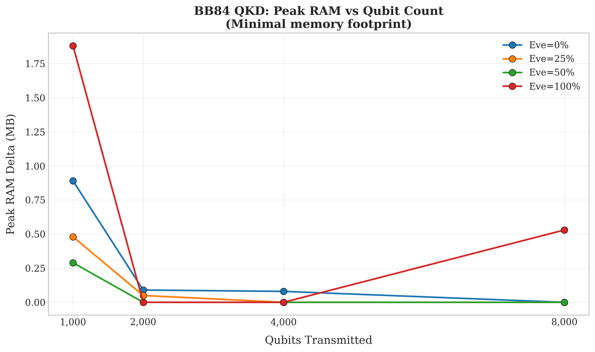

### BB84 QKD Layer 2 Depth
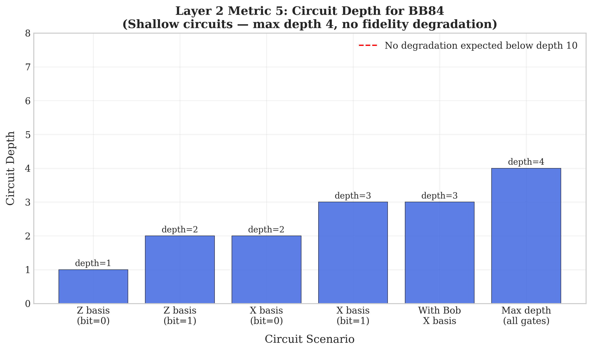

### BB84 QKD Layer 2 Fidelity
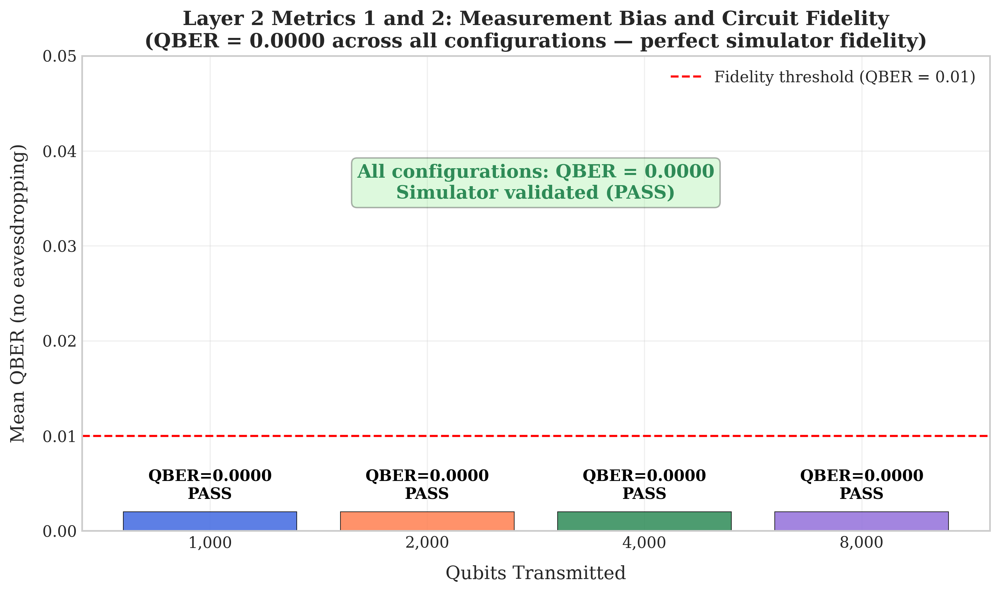

### BB84 QKD Layer 2 Noise
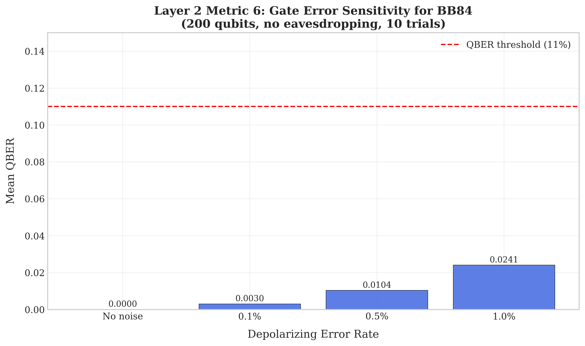

### BB84 QKD Layer 2 CV
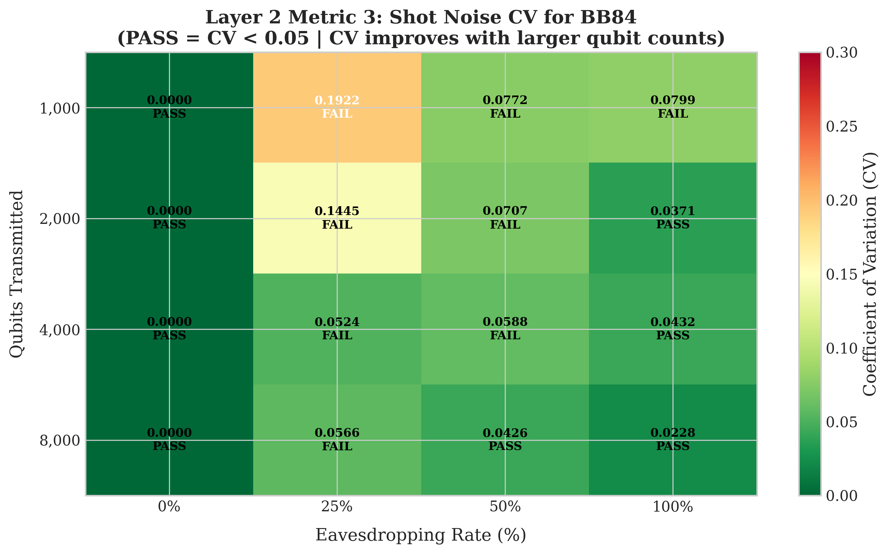

### BB84 QKD QBER vs Eavesdrop
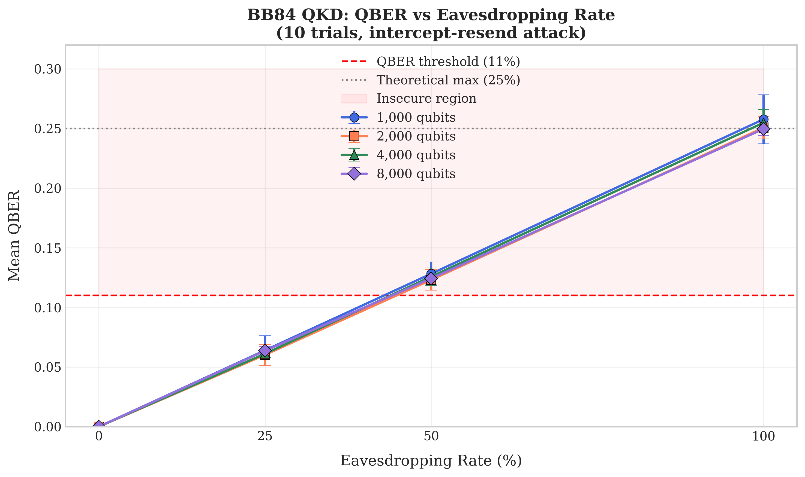

### BB84 QKD Sifted Key
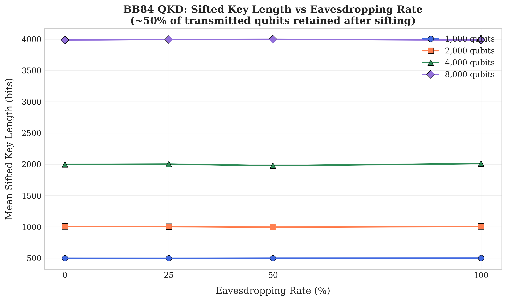

### BB84 QKD Secure Key Rate
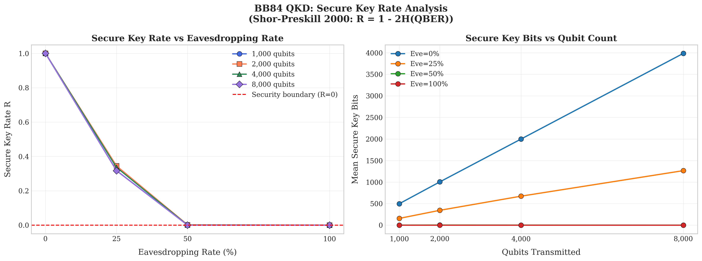

### BB84 QKD Security Heatmap
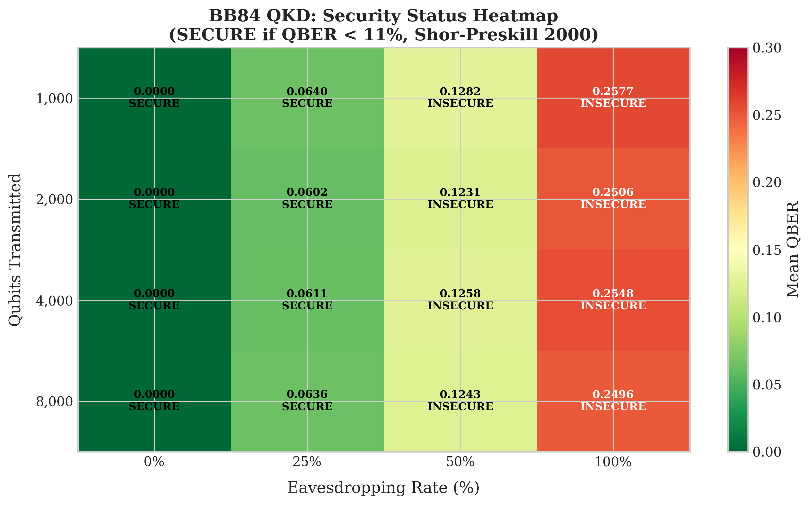
