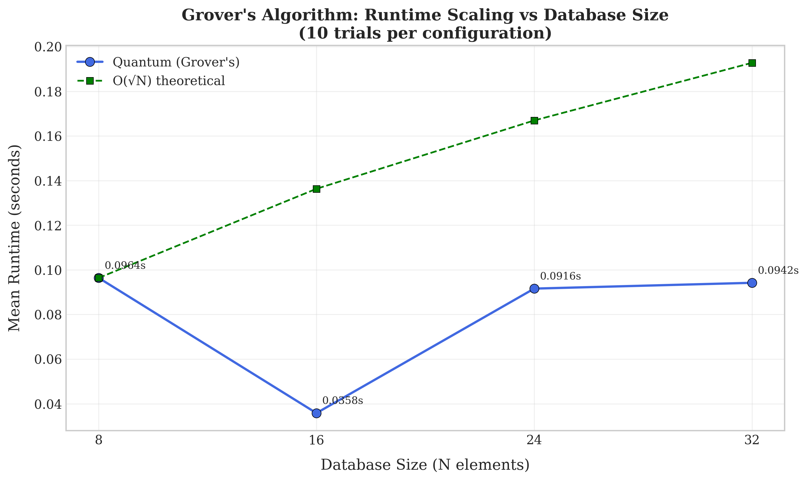
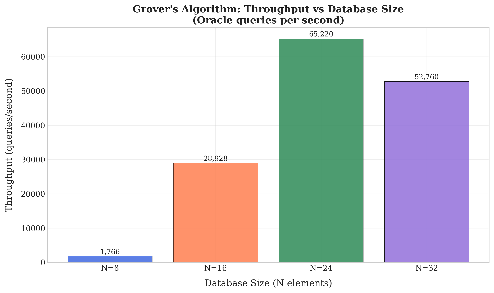
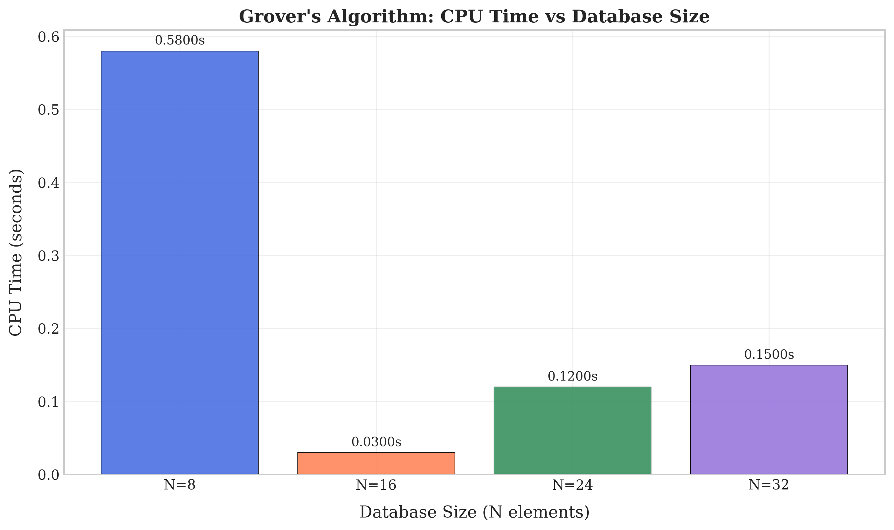
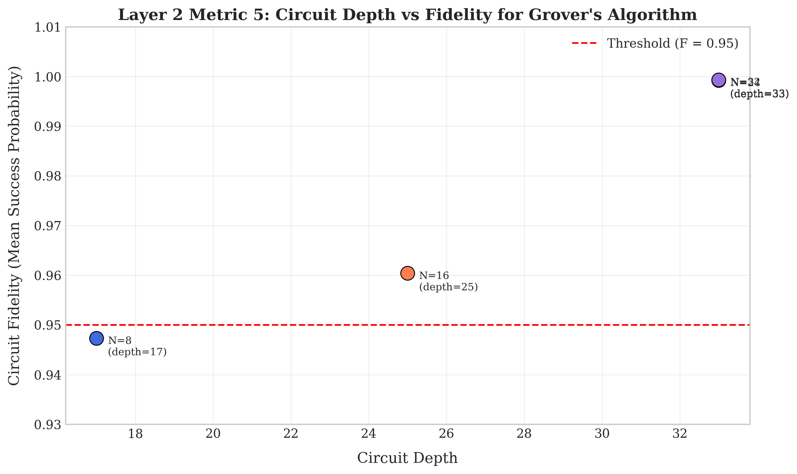
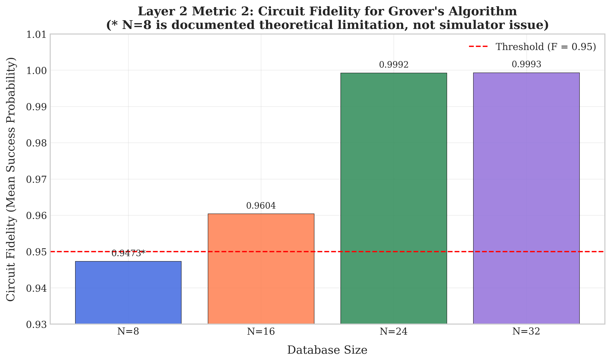
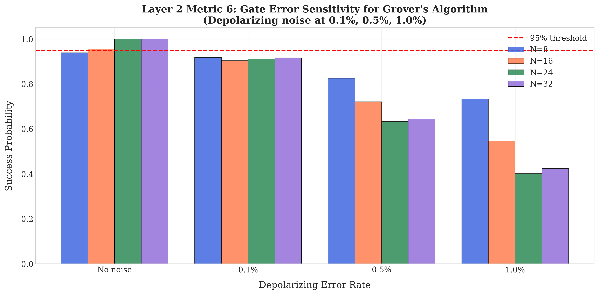
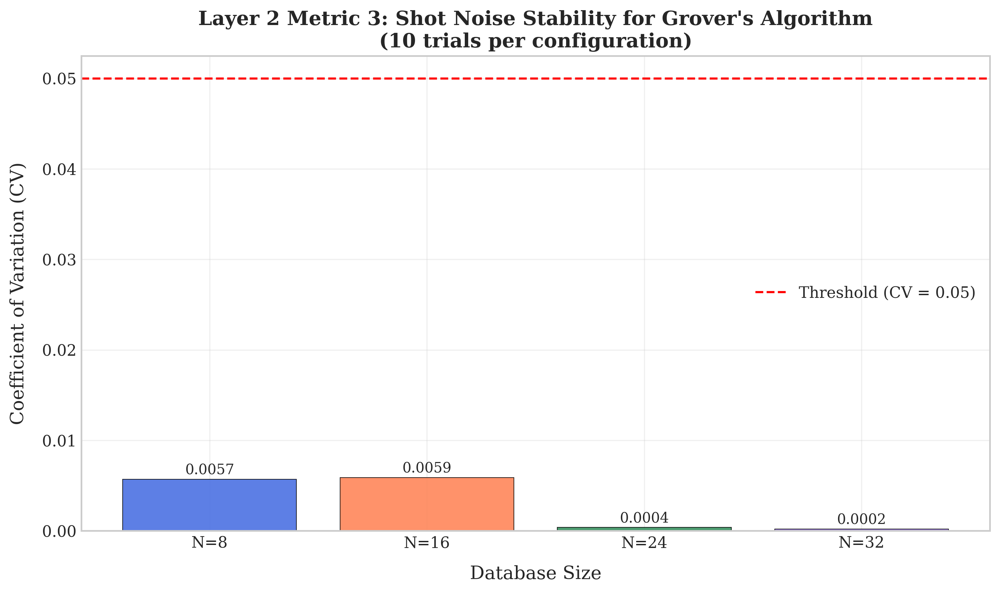
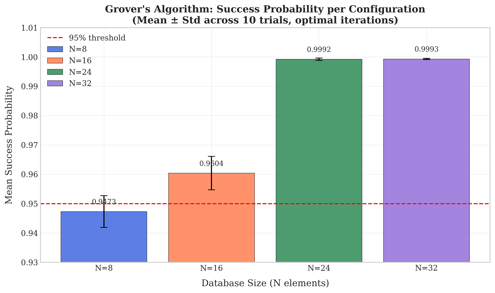
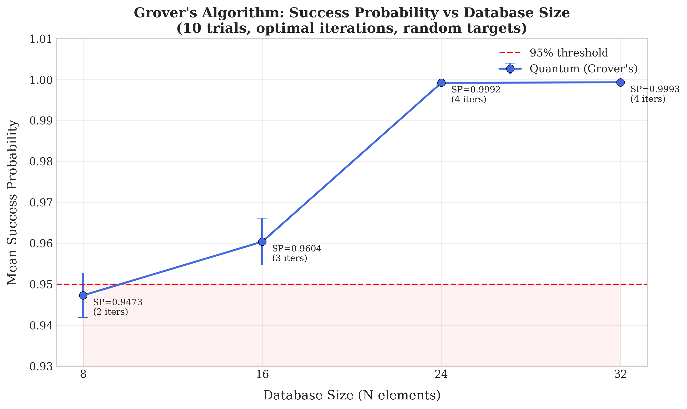

## RESULTS

* Grover Search Runtime Scaling
* Grover Search Performance Throughput
* Grover Search CPU Performance
* Grover Search Layer 2 Depth
* Grover Search Layer 2 Fidelity
* Grover Search Layer 2 Noise
* Grover Search Layer 2 CV
* Grover Search Success Distribution
* Grover Search Success Probability

---

### Grover Runtime Scaling

### Grover Performance Throughput

### Grover CPU Performance

### Grover Layer 2 Depth

### Grover Layer 2 Fidelity

### Grover Layer 2 Noise

### Grover Layer 2 CV

### Grover Success Distribution

### Grover Success Probability

