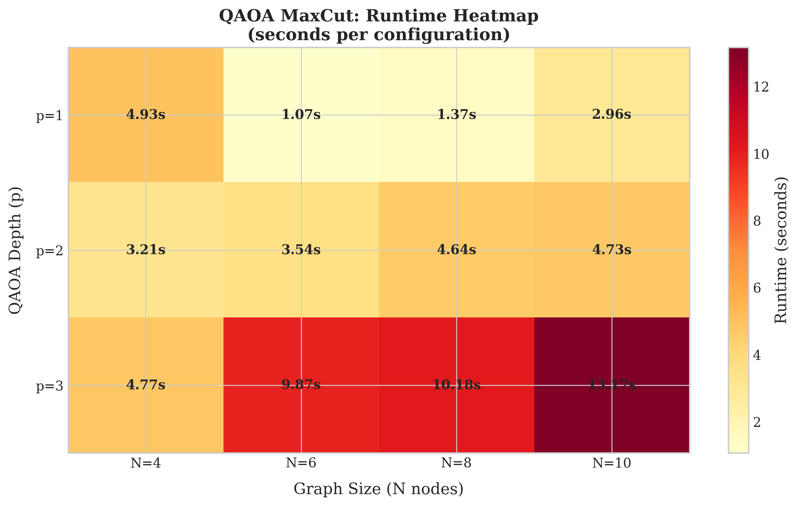
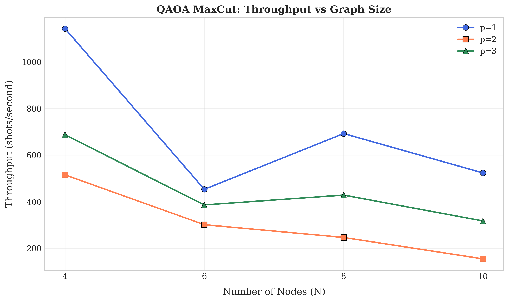
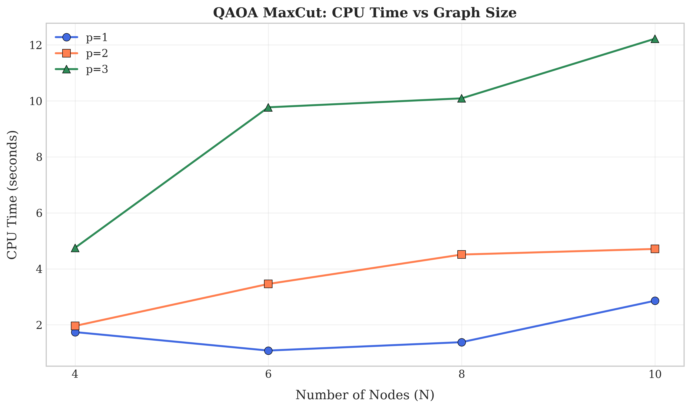
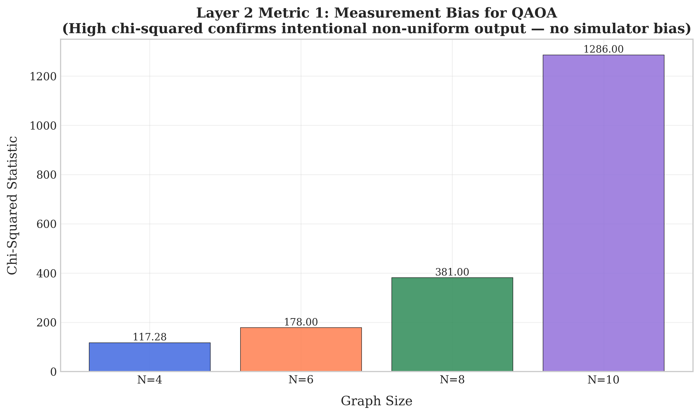
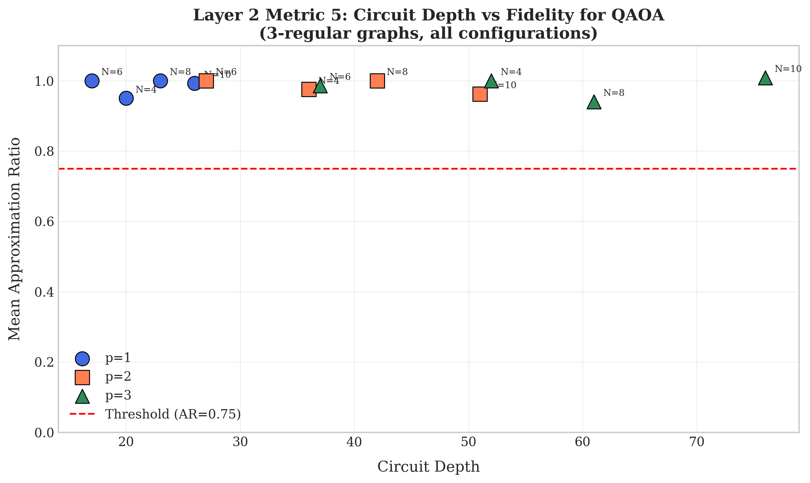
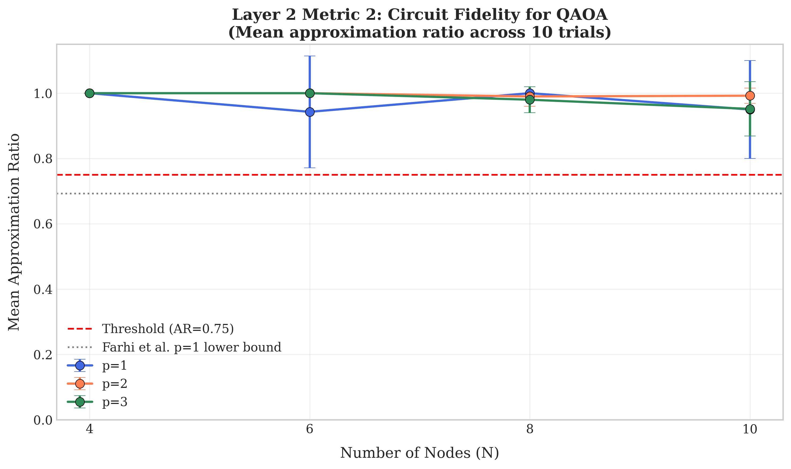
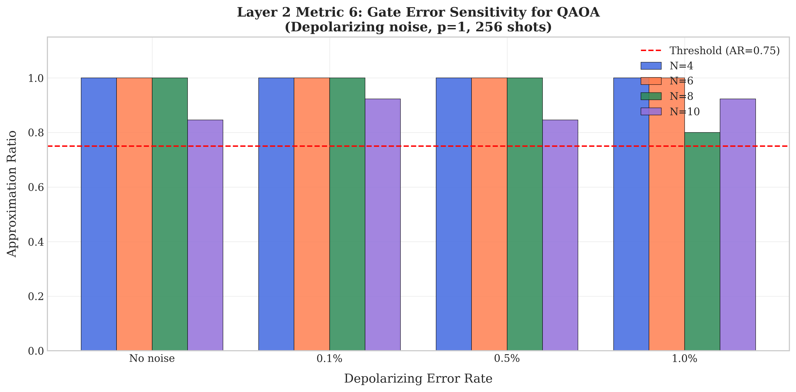
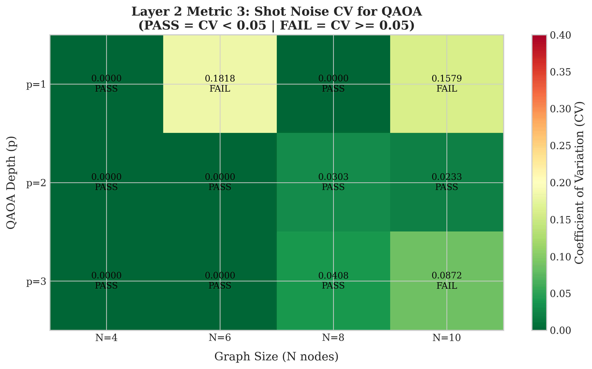
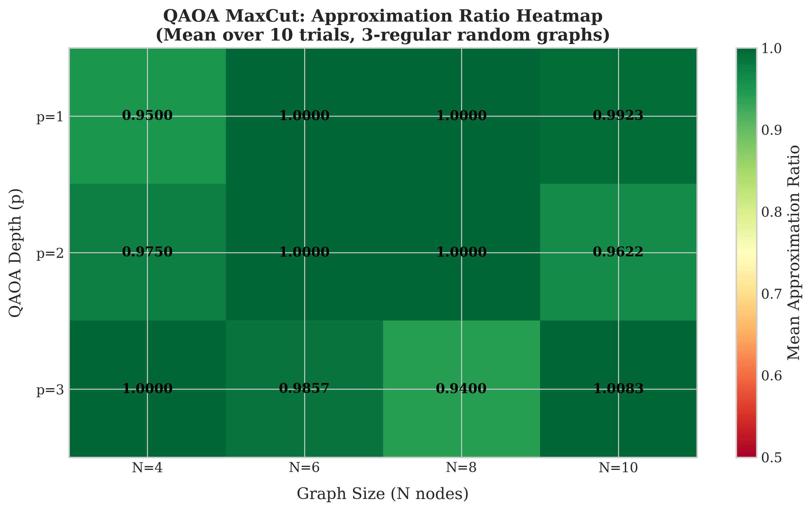

## RESULTS

* QAOA Performance Runtime
* QAOA Performance Throughput
* QAOA CPU Performance
* QAOA Layer 2 Bias
* QAOA Layer 2 Depth
* QAOA Layer 2 Fidelity
* QAOA Layer 2 Noise
* QAOA Layer 2 CV
* QAOA Heatmap
* QAOA Approximation Ratio

---

### QAOA Performance Runtime

### QAOA Performance Throughput

### QAOA CPU Performance

### QAOA Layer 2 Bias

### QAOA Layer 2 Depth

### QAOA Layer 2 Fidelity

### QAOA Layer 2 Noise

### QAOA Layer 2 CV

### QAOA Heatmap

### QAOA Approximation Ratio

