## RESULTS

* QRNG Shot Sweep
* QRNG Qubit Sweep
* QRNG Performance Latency
* QRNG Performance Entropy
* QRNG Performance Throughput
* QRNG CPU Performance
* QRNG Multiple Trials 10000 bits
* QRNG Multiple Trials 20000 bits
* QRNG Multiple Trials 40000 bits 
* QRNG Multiple Trials 80000 bits
* QRNG Layer 2 Bias
* QRNG Layer 2 Depth
* QRNG Layer 2 Fidelity
* QRNG Layer 2 Gate Error
* QRNG Layer 2 Shot Noise
* QRNG Comparison

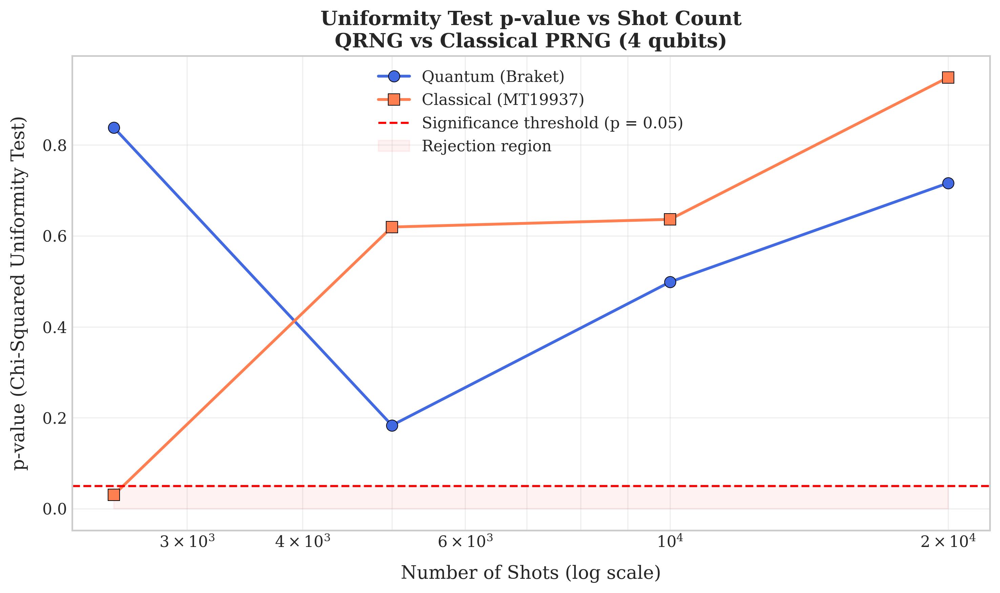
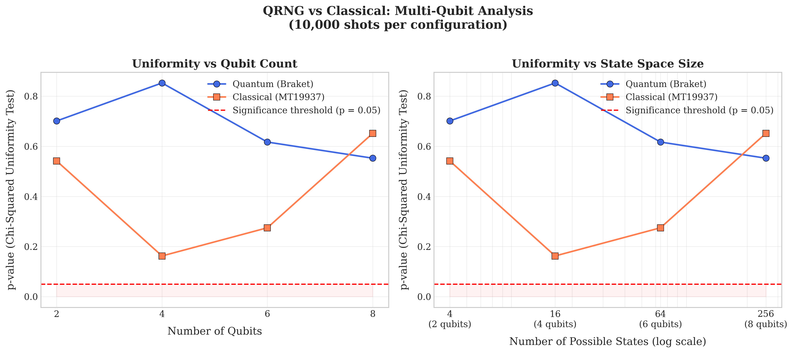
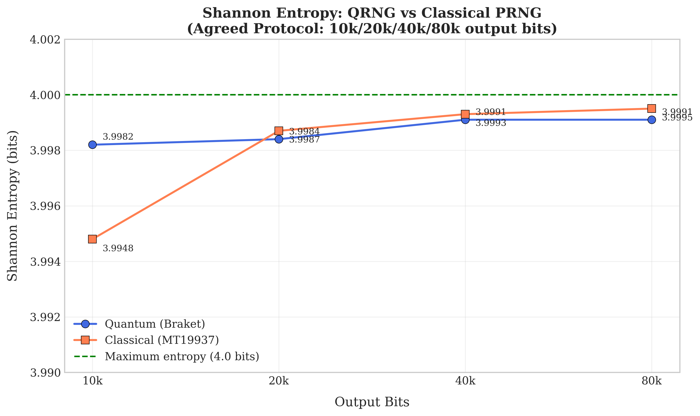
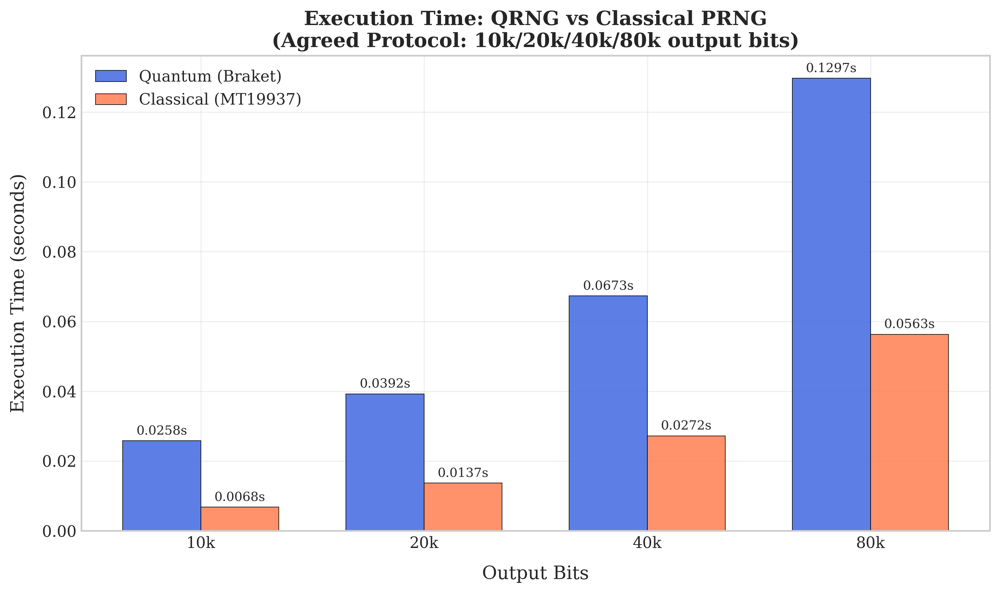
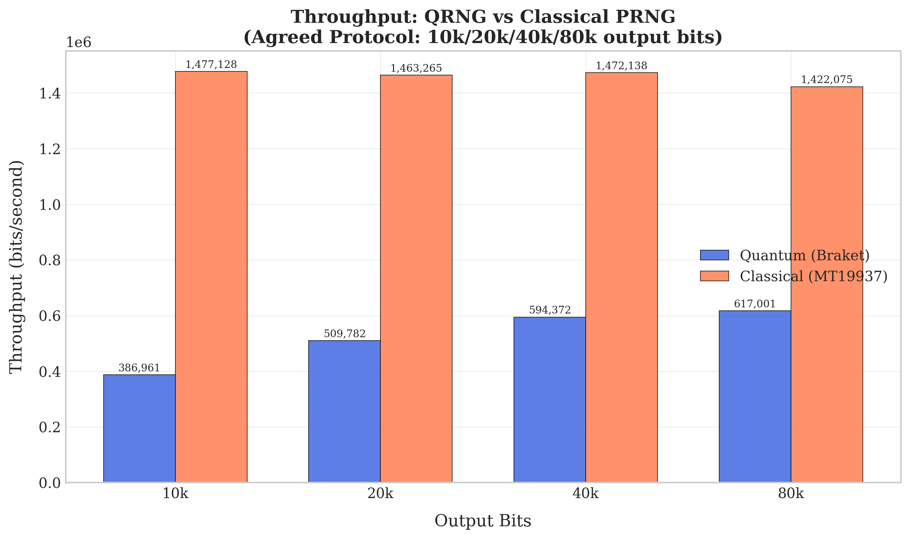
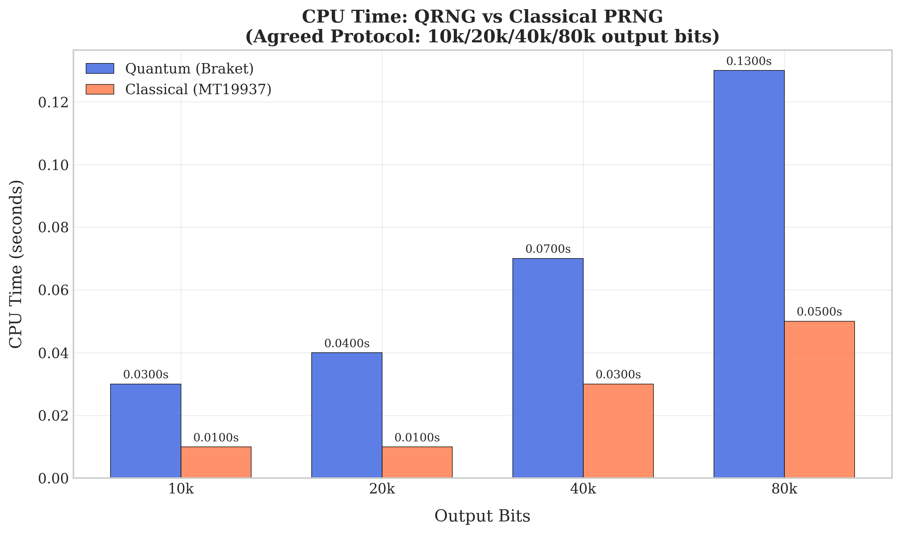
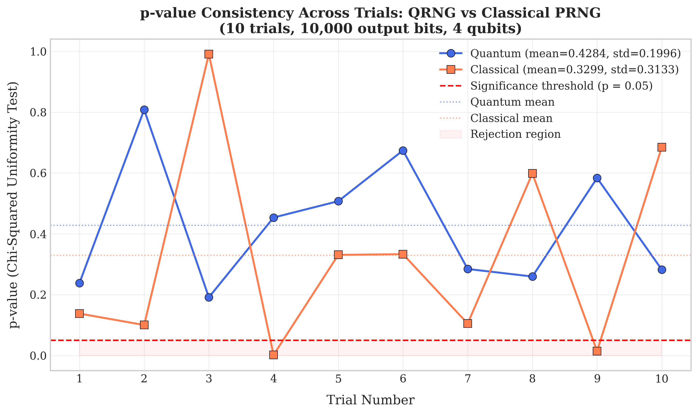
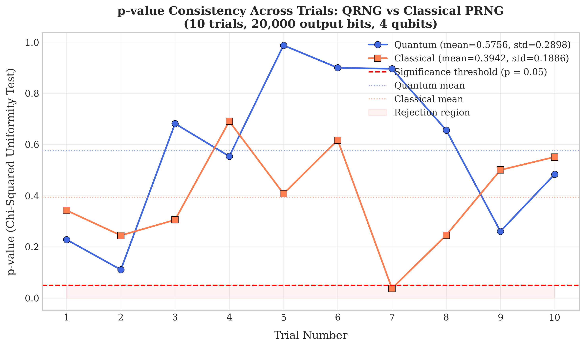
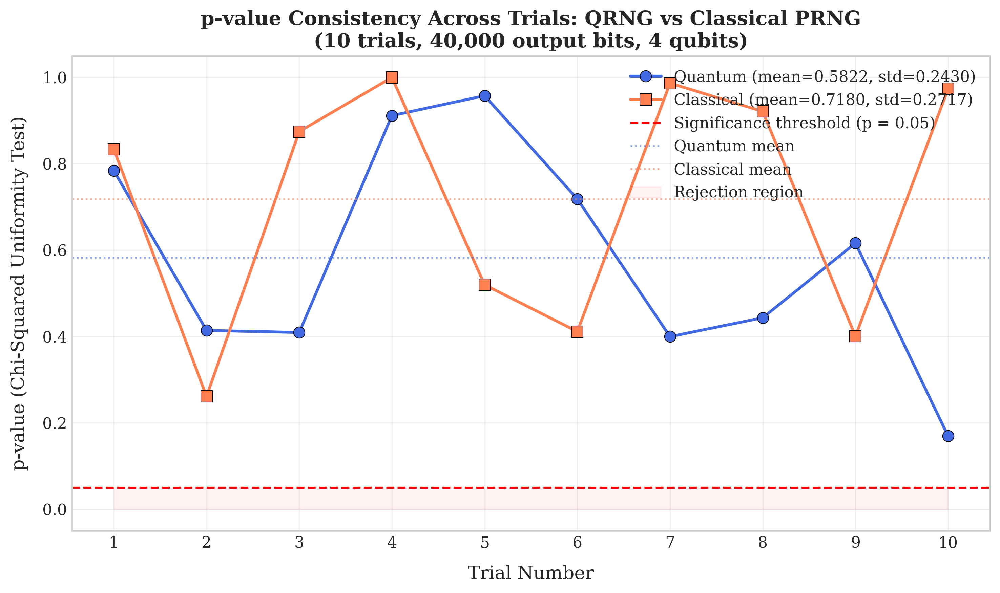
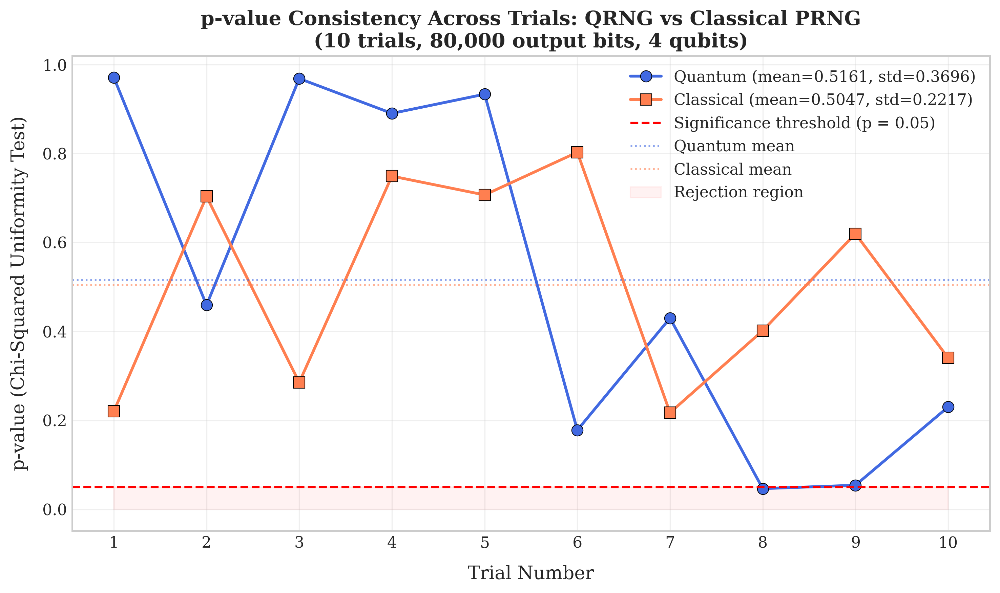
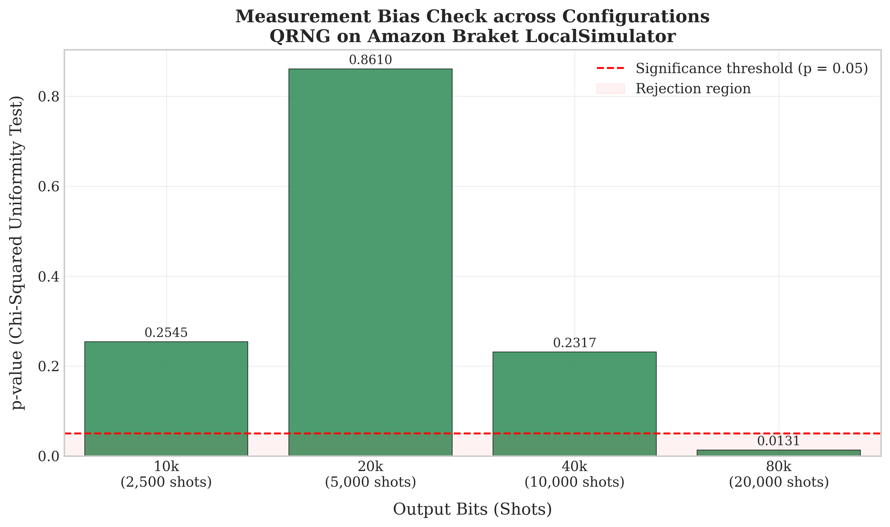
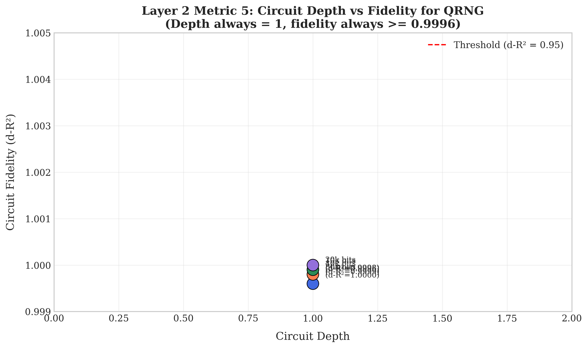
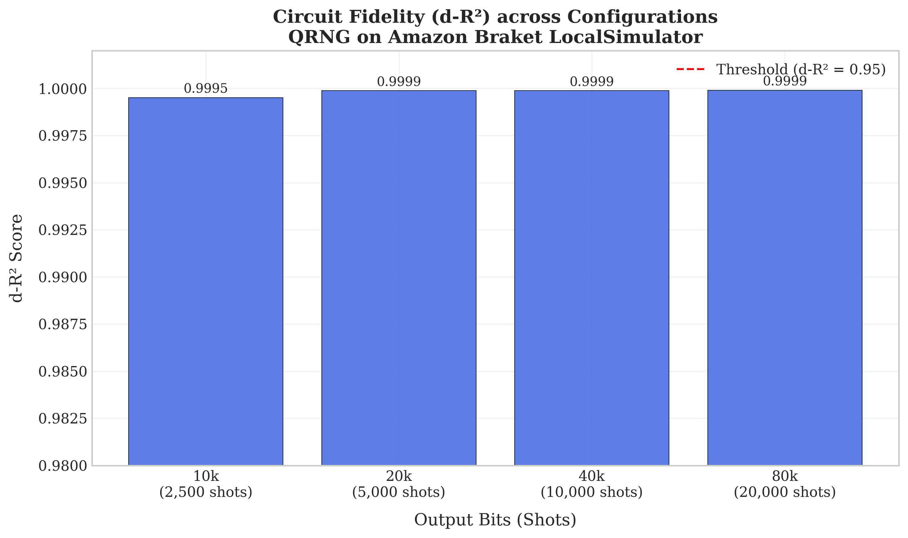
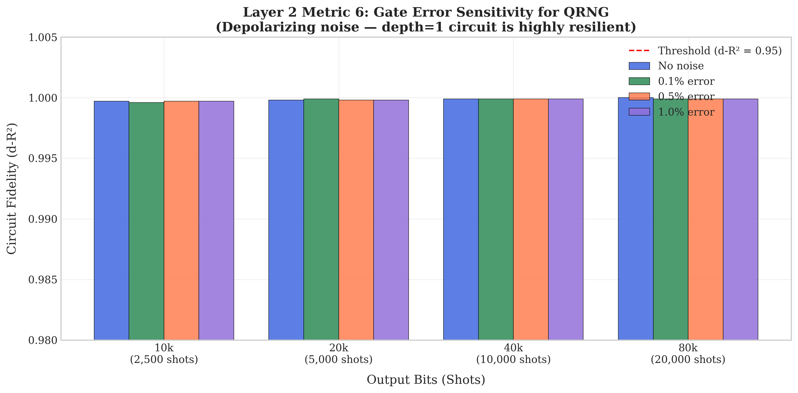
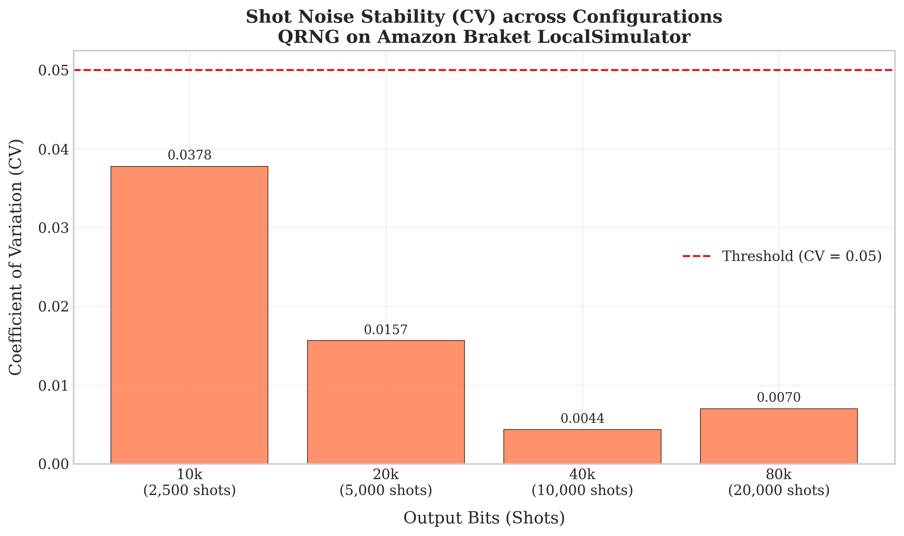
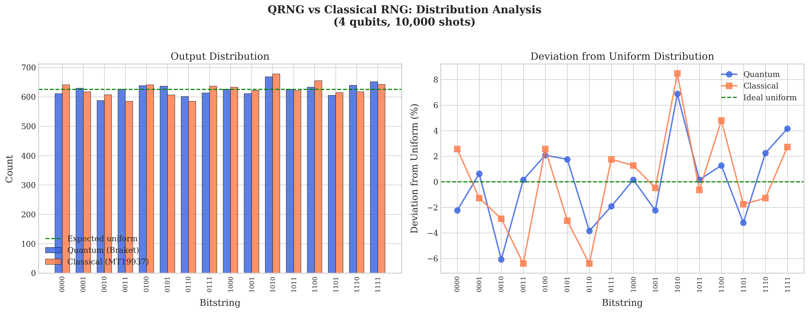
